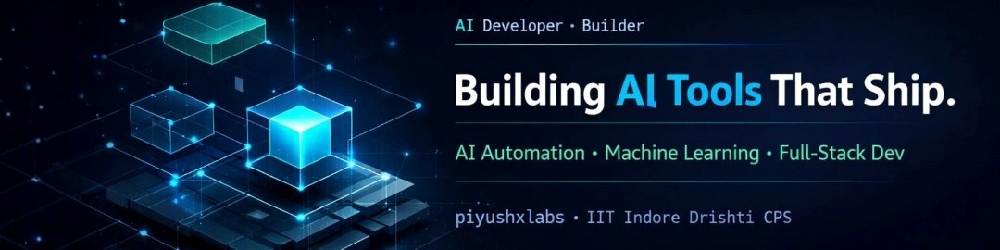

<!-- Profile Banner -->
<a href="https://github.com/piyushxlabs">
  
</a>

<div align="center">

<!-- HEADER -->


<!-- TYPING SVG -->
<a href="https://github.com/piyushxlabs">
  
</a>

<br/>

> **"Skills + Consistency = Freedom."**

<br/>

[](https://piyush-premium-portfolio.vercel.app)
[](https://linkedin.com/in/piyush-jaguri-a9169338b)
[](mailto:piyushjaguri13@gmail.com)

</div>

---

## 🧠 Who Am I?

I'm **Piyush Jaguri** — a **Vibe Coder**, **AI Automation Builder**, and **aspiring SaaS founder** from Dehradun, India.

I don't just learn tech. I **ship it.**

At 17, I'm building real AI automation tools, full-stack web apps, and data science projects — the kind that solve actual problems, not tutorial exercises. My edge is combining creative vision with technical execution — building fast, building smart, building things that work.

Currently deepening my foundations through **IIT Indore's Drishti CPS AI & Data Science Program** while running experiments, shipping projects, and building my network — one meaningful connection at a time.

I believe the future belongs to builders who move fast and think clearly. That's the game I'm playing.

---

## 🚀 What I Build

<table>
<tr>
<td width="50%">

### 🤖 AI Automation Tools
Python-powered bots and scripts that eliminate repetitive workflows. If a human is doing the same task daily — I automate it.

</td>
<td width="50%">

### 🌐 Web Apps & SaaS Products
Full-stack applications from zero to deployed. Next.js, React, FastAPI — live on the internet, used by real people.

</td>
</tr>
<tr>
<td width="50%">

### 📊 Data Science Projects
EDA toolkits, ML models, and data pipelines. Turning raw data into decisions that actually make sense for businesses.

</td>
<td width="50%">

### 🎨 Vibe-Coded Experiences
Where design meets code. Premium portfolios, client websites, and interfaces that stop visitors instantly.

</td>
</tr>
</table>

---

## 🛠️ Tech Stack

**Languages**


**Frameworks**


**AI / ML**


**Tools**


---

## ⭐ Featured Projects

<table>
<tr>
<td width="50%">

### 🏆 [piyush-premium-portfolio](https://piyush-premium-portfolio.vercel.app)
Premium AI-powered developer portfolio — dark theme, interactive animations, fully deployed on Vercel.

**Stack:** TypeScript · Next.js · Vercel

[](https://piyush-premium-portfolio.vercel.app)
[](https://github.com/piyushxlabs/piyush-premium-portfolio)

</td>
<td width="50%">

### 🤖 [ai-lead-qualification-bot](https://github.com/piyushxlabs/ai-lead-qualification-bot)
AI-powered lead qualification system using Google Gemini — automatically scores and qualifies inbound leads.

**Stack:** TypeScript · Next.js · Google Gemini API

[](https://github.com/piyushxlabs/ai-lead-qualification-bot)

</td>
</tr>
<tr>
<td width="50%">

### ⚙️ [AI-Automation-Bots](https://github.com/piyushxlabs/AI-Automation-Bots)
Python automation bots that eliminate repetitive manual workflows — real time savings, real business value.

**Stack:** Python · Automation · APIs

[](https://github.com/piyushxlabs/AI-Automation-Bots)

</td>
<td width="50%">

### 📊 [Data-Insights-Scripts](https://github.com/piyushxlabs/Data-Insights-Scripts)
EDA toolkit built specifically for small businesses — turns raw data into clear, actionable insights fast.

**Stack:** Python · Pandas · NumPy · Matplotlib

[](https://github.com/piyushxlabs/Data-Insights-Scripts)

</td>
</tr>
</table>

---

## 📊 GitHub Stats

<div align="center">


<br/><br/>


</div>

---

## 📡 Currently Learning & Building

```python
current_status = {
    "program"   : "IIT Indore — Drishti CPS AI & Data Science (Nov 2025 – May 2027)",
    "learning"  : ["PyTorch", "FastAPI", "System Design", "Advanced ML"],
    "building"  : ["AI automation tools", "SaaS products", "piyushxlabs brand"],
    "next_goal" : "Launch first AI SaaS product — June 2026",
    "belief"    : "Skills + Consistency = Freedom."
}
```

---

## 📣 Content & Community

I don't just build — I **document and share.**

- 🎥 Creating content that simplifies AI & Data Science for everyone
- 🌍 Building in public — sharing wins, failures, and learnings openly
- 🤝 Connecting with founders, builders, and entrepreneurs in the AI space
- 💡 Belief: the best way to learn is to teach

If you're building something at the intersection of AI and business — **I want to hear about it.**

---

## 🤝 Let's Connect

<div align="center">

I'm not looking for the next tutorial.
I'm looking for the next **collaboration, conversation, or opportunity** that pushes me forward.

If you're a **founder, builder, mentor, or entrepreneur** — let's talk.

<br/>

[](https://piyush-premium-portfolio.vercel.app)
[](https://linkedin.com/in/piyush-jaguri-a9169338b)
[](mailto:piyushjaguri13@gmail.com)

</div>

---

<div align="center">


**The best time to start building was yesterday. The second best time is now.**

*If this profile resonated — drop a ⭐ on any repo. It means more than you think.*


</div>

<p align="center">
  
</p>

<p align="center">
  <b>⭐ Turning Ideas into Intelligent Tools that Save Time ⭐</b>
</p>
